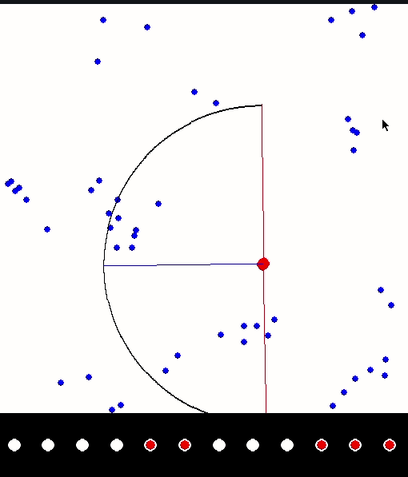
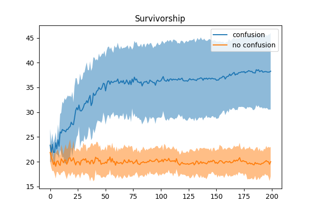
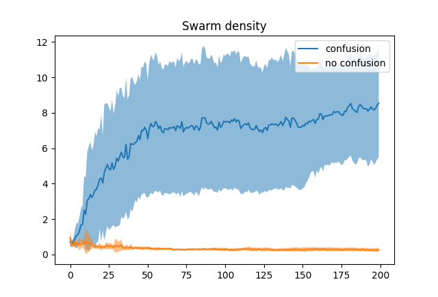
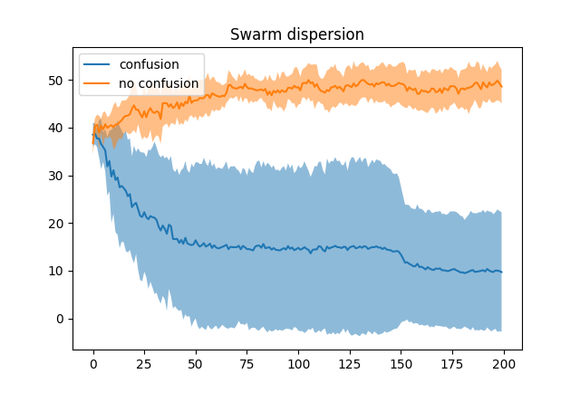
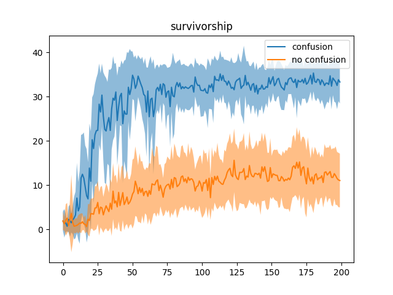
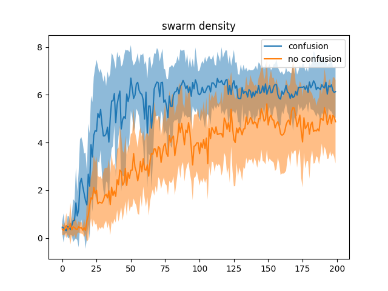
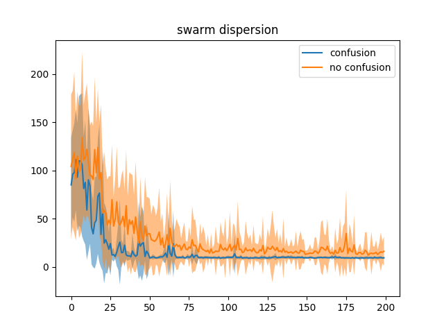

# IAR PROJECT

In this project we tried to reproduce the study [Predator confusion is sufficient to evolve swarming behaviour]([https://royalsocietypublishing.org/doi/10.1098/rsif.2013.0305)

We diverged a little bit from the paper by using CMA-ES instead of their evolution algorithm which provided us with much faster convergence rate. 

Also we are not using Makov networks but plain feed forward neural neural networks which parameters are learned through CMA-ES.

All the other parameters are similar to the paper, except when explicitely mentioned to be different.

## Simulation engine

We implemented a simulation engine in C++ which you can find in the module subfolder. In order to build it you must have the following dependencies :

* boost / boost_python
* cmake
* a C++ 11 compatible compiler
* A python interpreter ( 3.7.X  are the only tested version )
* torch C++ frontend

To download the torch C++ frontent, a script is present in the module subfolder which will downlad and unzip libtorch in the proper location to be found by cmake :

```sh
$ cd module
$ ./get_torch.sh
```
You can now build the module :
```sh
$ mkdir build
$ cd build
$ cmake .. ( or cmake -DCMAKE_BUILD_TYPE=Debug .. if you want debug symbols )
$ make -j4
```
The module pylib.so should now be present in the build directory.

### How to use it 

This module is a python module, which means it can be used like any other module :
from the root directory :

```python
from module.build import pylib
```

It exports one single Object : Simulation

```python
s = pylib.Simulation(network_input_size, network_output_size,
					 num_preys, num_preds, env_x, env_y, eat_distance, confusion)
s.reset_population()
s.load_prey_genotype(PREY_GENOTYPE)
s.load_predator_genotype(PREDATOR_GENOTYPE)
results = s.run(timesteps)
```

where results is a 1-D array holding : [SWARM_DENSITY, SWARM_DISPERSION, PREY_FIT, PRED_FIT, SURVIVORSHIP]

A second way to use this module intented for the rendering engine described later is the step_hook function expecting two callables prey_hook and predator_hook that will allow to get the positions of the individuals and more informations at every timestep of the simulation. Using step_hook disable the calculation of the fitnesses which are not intended to be used in the rendering engine. An example can be found in the render.py script

## Training script(s)

Two scripts exsist for training : all.py and evol.py

You must hold the following modules in order to run any of them :
* numpy
* cma


evol.py is intended to be used for one single highly configurable co-evolution while all.py is to do N co-evolutions with the fixed parameters that we used to generate our results.

all the parameters for both scripts can be found using the following commands :

```sh
$ python evol.py --help
$ python all.py --help
```

In the results dir that you choose , you will find 2  subfolders one for confusion results and one for no_confusion results, In each of those you will find all the data about the evolution in numpy array format alongside with the best preys and predators from several timesteps of the simulation. Those genotype are to be used with the rendering script to visualise clearly the behaviour of both.

Please note that to improve training time, it is possible to pass a pretrained predator genotype to evol.py in order to skip the predator pre-training phase.

## Rendering script

The rendering ads yet another dependency :

* pygame

You can once again find all the available parameters by using the following command :

```sh
python render.py --help
```
The keyboard can be used to control the speed of the simulation , arrow UP and DOWN will respectively increase and decrease the FPS count by 10.

One example of rendering command might be :

```sh
python render.py --pred=results/confusion_0/best_pred.npy --prey=results/confusion_0/best_prey.npy --fps 30

```
Not specifying --pred or --prey will generate a random genotype for both of them.



## Controllers

As stated in the introduction, instead of using markov networks we used simple feed forward neural network. Using only Linear layers with Relu activations functions.

The only difference between the two networks is the number of input parameters as the preys have a dual layer retina allowing the detection of both preys and predators while the predators ( which are supposed to be alone in the simulation ) can only detect preys in their field of view.

In order to visualize properly , here is a representation of the predator network :


And the following is the prey network :


## Results

We ran 10 co evolutions with the following parameters :

* eat_distance = 9
* nb_gen = 200
* nb_gen_pred = 100
* popsize = 10
* save_freq = 20
* predator_speed = 3
* prey_speed = 1

We observed the following :





As in the paper, we observed swarming behaviour with confusion but never without confusion.

On a side note, during development we noticed that with higher speed, swarming behaviour can emerge even without confusion.

* eat_distance = 9
* nb_gen = 200
* nb_gen_pred = 100
* popsize = 10
* save_freq = 20
* predator_speed = 9
* prey_speed = 3





Which tends to prove that even if confusion is a sufficient condition to the emergence of swarming behaviour, it is not a necessary condition.
